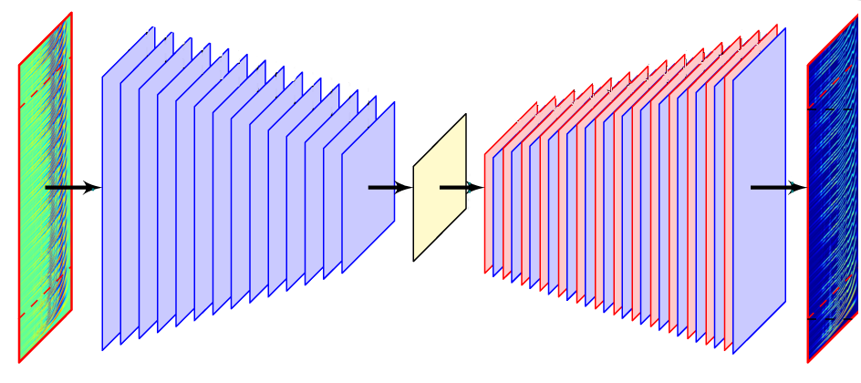
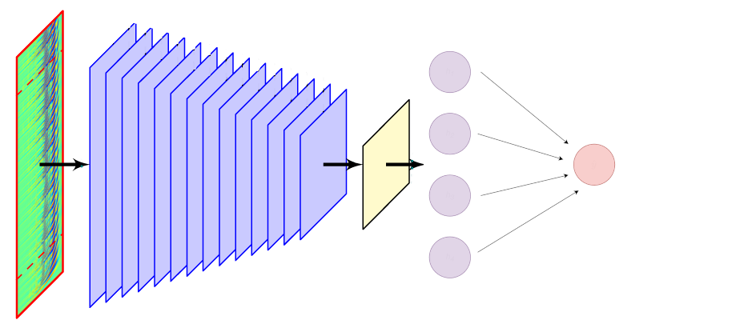

# Space Apps 2024 Seismic Detection

Welcome to my Space Apps 2024 repository!

## Challenge
**Seismic Detection Across the Solar System**

Planetary seismology missions struggle with the power requirements necessary to send continuous seismic data back to Earth. But only a fraction of this data is scientifically useful! Instead of sending back all the data collected, what if we could program a lander to distinguish signals from noise, and send back only the data we care about? Your challenge is to write a computer program to analyze real data from the Apollo missions and the Mars InSight Lander to identify seismic quakes within the noise!

## What I did
I designed, coded, trained, and evaluated a machine learning model for the task of labelling seismic data. Due to time constraints, I only focused on the Moon data and not on Mars. Much of the same code could be applied to the Mars data, with minor adjustments.

### Data

As part of the [Space Apps Seismic Detection Data Package](https://www.spaceappschallenge.org/nasa-space-apps-2024/challenges/seismic-detection-across-the-solar-system/?tab=resources), NASA provide labelled training data for Mars and the Moon, but the amount of data they provide is far too little to train a machine learning model. So instead, I will be using the unlabelled data from [XA (1969-1977): Apollo Passive Seismic Experiments](https://www.fdsn.org/networks/detail/XA_1969/) to create a pretrained model that can later be fine-tuned on the labelled data for the downstream task of predicting the seismic event arrival time.

### Model

There are two models used for this project. 

The first is a CNN Autoencoder that is trained on the unlabelled passive Apollo data. This model works by taking the spectrogram as an input, reducing it down into a compressed representation of the input, and then expanding it back up to try and predict the original input. The intuition behind encoders is that if it is able to accurately reconstruct the input from the compressed representation, that representation must have learnt some useful and important information about that data. 



The second model uses part of the CNN Autoencoder that compresses the data and then connects a linear layer at the end. This new model is then trained on the labelled data to predict the arrival time of the seismic event. The idea is that due to the data already being represented in a compressed and useful way, it will only take a small simple model trained on a small amount of data to predict the arrival time.



### Results

Images and stats

## Run my code

### Enviroment
Use [Conda](https://www.anaconda.com/download) to set up an enviroment with the requirements.yml file. 

```bash
conda env create -f requirements.yml
```

### Data

The download_data.py file can be run to download data from [XA (1969-1977): Apollo Passive Seismic Experiments](https://www.fdsn.org/networks/detail/XA_1969/) for pretraining the CNNAutoencoder model. 

I have kept the lunar training data so that you are able to test the SeismicEventPredictor model by running the evaulate.ipynb file.

### Training Notebooks

There are two notebooks to train the two seperate parts of the model. The pretrain.ipynb file trains a new model using the CNNAutoencoder model class defined in models.py. Then, finetune.py uses the encoder layers of the model created from the pretraining.

## Resources 
- [Apollo 11 Seismic Experiment](https://science.nasa.gov/resource/apollo-11-seismic-experiment/)
- [Apollo 12 Passive_Seismic Experiment Wiki](https://en.wikipedia.org/wiki/Apollo_12_Passive_Seismic_Experiment)
- [Moonquakes](https://www.sciencedirect.com/topics/earth-and-planetary-sciences/moonquakes)
- [Lunar seismology Wiki](https://en.wikipedia.org/wiki/Lunar_seismology)
- [PyTorch Documentation](https://pytorch.org/docs/stable/)
- [XA (1969-1977): Apollo Passive Seismic Experiments](https://www.fdsn.org/networks/detail/XA_1969/)
- [Space Apps Seismic Detection Data Pack](https://www.spaceappschallenge.org/nasa-space-apps-2024/challenges/seismic-detection-across-the-solar-system/?tab=resources)